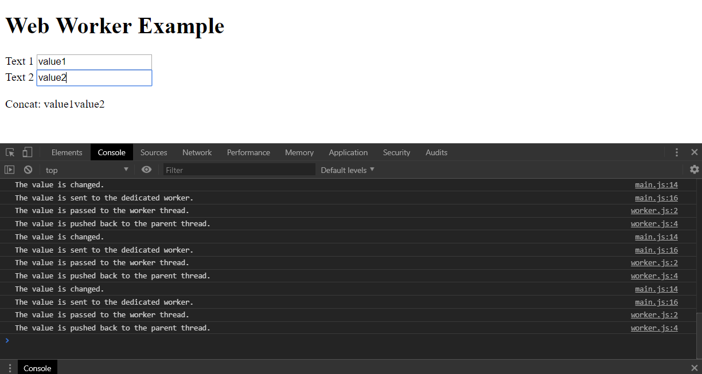

# Web Worker Example
An example to concatenate values of `HTMLInputElement` using `Web Workers API`.

- [Using Web Workers - Web APIs | MDN](https://developer.mozilla.org/en-US/docs/Web/API/Web_Workers_API/Using_web_workers)
- [Web Workers API - Web APIs | MDN](https://developer.mozilla.org/en-US/docs/Web/API/Web_Workers_API)
- [mdn/simple-web-worker: A simple web worker test.](https://github.com/mdn/simple-web-worker)
- [HTMLInputElement - Web APIs | MDN](https://developer.mozilla.org/en-US/docs/Web/API/HTMLInputElement)
